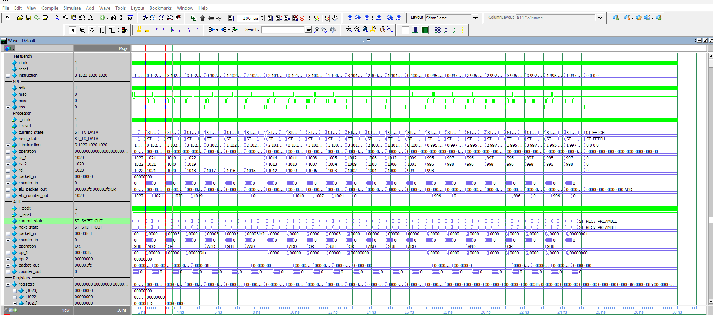

# Trabalho 1 - Processador com SPI

Alunos:  
- **Guilherme Korssak Gonçalves**  
- **Fernando Rossini Meggiolaro**

---

## Descrição

Este trabalho implementa um processador simples em SystemVerilog, dividido em estágios de execução, que se comunica com as unidades funcionais (ALU, multiplicador e barrel-shifter) através de uma interface **SPI**.

O processador possui:  
- Banco de registradores.  
- Unidade de Controle com máquina de estados (FSM).  
- ALU com instruções `ADD`, `SUB`, `AND`, `OR`.  

## Simulação

A simulação foi feita no **ModelSim - Intel FPGA Starter Edition**.  
Abaixo um exemplo de waveform mostrando a execução das instruções, com registradores variando e operações sendo processadas corretamente pela ALU via SPI:



---

## Como rodar

1. Abrir o ModelSim.  
2. Executar o script de simulação:

```tcl
do sim.do
```

3. Abrir o waveform com:

```tcl
do wave.do
```

4. Rodar a simulação completa:

```tcl
run -all
```

---

  

